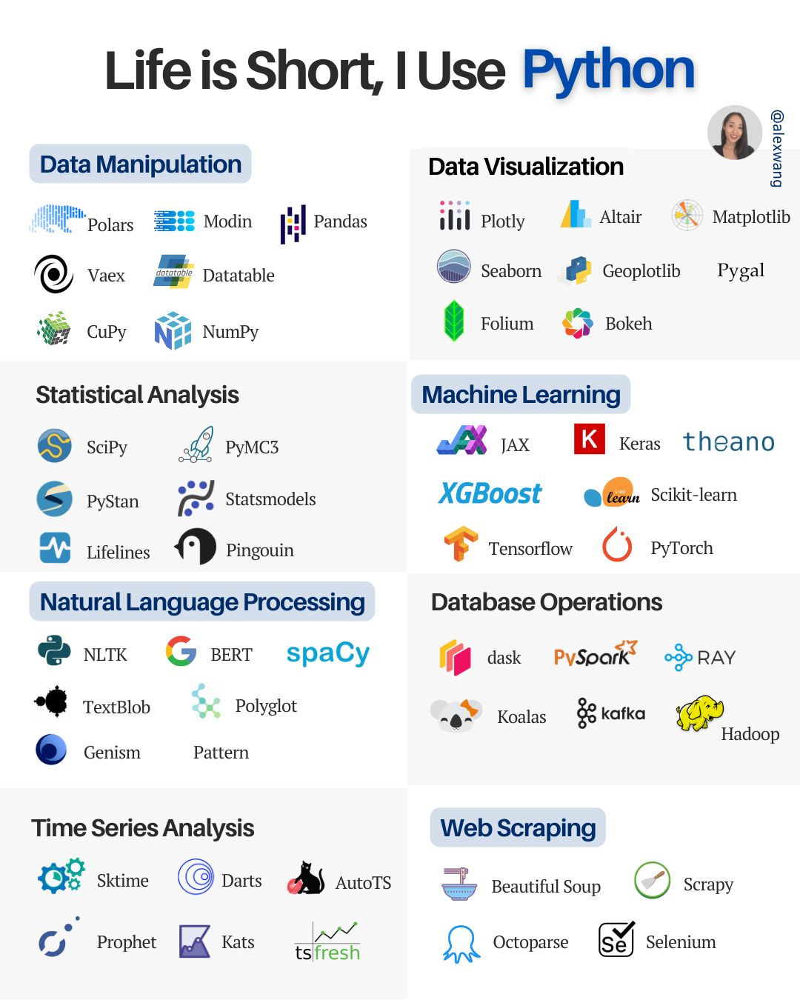
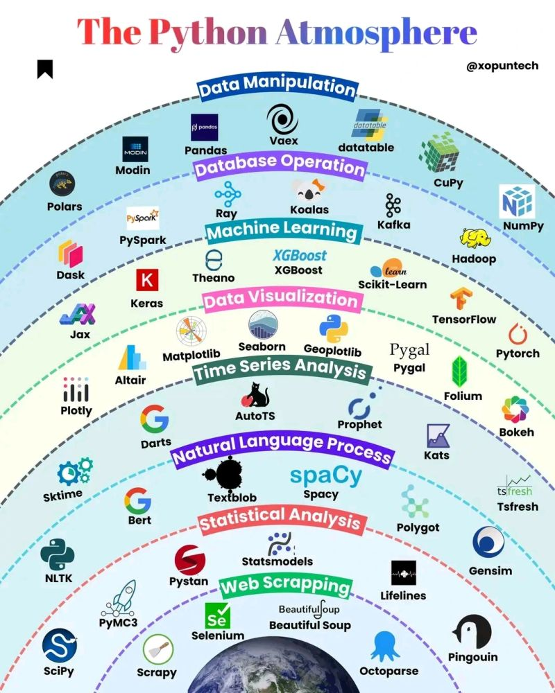

# Portfolio
    ◦ Photos of projects with Summaries
    ◦ Projects: My role, difficulties faced, solution, features, technologies used
    ◦ Projects on main page
    
Completed Projects: 
• React Native group project (PearShare)
• Stellar observations programming and python FFT (Github)
• Balloon Game (Github)
• Fractal
• Physics FFT in python classical mechanicsTree
• Machine Learning Assignment 1
• ML Assignment 2

• Table for millennium Falcon
• Work Bench

• Watermelons
• Sunflowers
• Chillis
• Sunflowers 2.0
• Chillis 2.0

• Millennium Falcon
• Lego Boba Fett
• Lego Saturn V
• Desktop Computer
• Millennium Force
• 36 Cube

Upcoming Projects:
• Thesis, Thesis Website - ethicalaiguide.com, Infographic
• Data science projects
• Road-maps of larning goals (Data, Quantum, Learning)
• Maps of knowledge, Rhumbl, experts in each field: C++
• 8-bit computer
• Sunflowers 3.0
• Orrery (Patent idea)
• 3D Print Roller Coaster
• Chess Board
• Side Table with Curved Legs
• Canoe

# Learn, Create, Inspire.

- **Home (contact me)**
- **About me (Name, contact, education, mission statement)**
    
    Resume
    
    Github
    
    LinkedIn
    
- **My Skills/Self Learning and reading**

Tools you have used:

- Vscode
- Coding languages
- Matplotlib, Numpy, Pandas
- MATLAB
- Fourier Transforms
- Work/ Projects/Industry Experience
- Contact
- Hobbies/ Blog (Catalog of articles)(give sense of who you are)/Reading list
- Secure website
- Interactive
- Sound

# Data Science and AI
end-to-end in data science; stakeholder engagement, data exploration, data management, research, model selection, feature engineering, model building, testing, optimising & deployment 

### End to End Process
- Cleaning
- Exploration
- Story Telling

### Mathematics

- Optimisation
- Probability and Statistics
- Linear Algebra
- Discrete Maths
- Calculus

### Python

### SQL

### R

### Excel

### Machine Learning

### Neural Networks

### Deep Learning

- Hands-on experience with machine learning libraries and frameworks (e.g., TensorFlow, PyTorch, scikit-learn) and proficiency in programming languages such as Python, Scala and/or R.
- Deep expertise with the various capabilities available when tailoring a model, e.g.:
    - Learning paradigms (supervised, unsupervised, reinforcement)
    - Problem types (classification, regression, generative)
    - Architectures (linear models, trees, neural networks, ensembles)
    - Purposes (predictive, descriptive, prescriptive)
    - Hyperparameters (learning rate, epoch counts, depth)
    - Other optimization techniques (feature engineering, regularization, tuning)
    - Performance evaluation (recall, RMSE, learning curves, benchmarking)

**Mathematics:** 

• Mathematics 1A
• Mathematics 1B
• Discrete Maths
• Mathematics 2A
• Mathematics 2B
• Mathematical Computing  

• Functions, Limits, Continuity, Differentiation, Applications of Differentiation
• Integration, Applications of Integration, Techniques of Integration
• First-Order Differential Equations, Second-Order Linear Differential Equations
• Complex Numbers
• Sequences and Series, Power Series, Taylor Series
• Multivariable Calculus, Vector Calculus, Differential Equations, Linear Algebra
• Vector Spaces, Linear Transformations, Eigenvalues and Eigenvectors, Applications of Linear Algebra |

**Physics:**  

• Physics 1A
• Physics 1B
• Classical Mechanics and Special Relativity 

• Mechanics, Kinematics, Dynamics, Work and Energy, Momentum and Collisions, Rotational Motion, Gravitation, Oscillations
• Waves, Fluids, Thermodynamics, Electricity and Magnetism, Electrostatics, Current and Resistance, Circuits, Optics
• Newtonian mechanics, Lagrangian and Hamiltonian mechanics, Central force problems, Special relativity, Lorentz transformations, Relativistic kinematics 

**Electrical and Telecommunications Engineering:** 

• Electrical and Telecommunications Engineering
• Circuits and Signals
• Analogue Electronics 

• Circuit analysis, Circuit theorems, Energy and power, Signals and systems, Time and frequency domains, Fourier analysis, Sampling
• Op-amps, Diodes, Transistors, Amplifiers, Oscillators, Filters
• Network theorems, AC circuits, Frequency response, Laplace transforms, Fourier transforms, Signals and systems, Sampling
• Process management, Memory management, File systems, Input/output systems, Interprocess communication, Scheduling algorithms, Deadlock prevention
• Computer system organization, Processor architecture, Memory hierarchy, Input/output systems, Performance evaluation 

**Computer Engineering:** 

• Computer Systems Fundamentals
• Digital Circuits and Systems
• Computer Architecture
• Operating Systems  

• Introduction to computer systems, Digital logic, Assembly language programming, Processor architecture, Memory hierarchy, Input/output systems
• Boolean algebra, Combinational logic, Sequential logic, Synchronous sequential circuits, Finite-state machines, Timing issues, Digital system design
• Collaborative software engineering project, Requirements gathering, Design and implementation, Testing and quality assurance, Project management, Professional communication skills
• Final project demonstration, Project documentation, Professional presentation skills 

**Software Engineering:**  

• Programming Fundamentals
• Software Engineering Fundamentals
• Object-Oriented Design and Programming
• Data Structures and Algorithms
• Database Systems
• Human Computer Interaction
• User Interface Design and Construction
• Software Architecture for Blockchain Applications 

• Software development methodologies, Requirements engineering, Software design and architecture, Software testing and quality assurance, Software project management, Software maintenance and evolution
• Object-oriented programming concepts, Abstraction and encapsulation, Inheritance, Polymorphism, Interfaces, Abstract classes, Exceptions, File I/O
• Basic data structures, Stacks, Queues, Linked lists, Trees, Graphs, Sorting and searching algorithms, Algorithm analysis, Recursion
• User-centered design, Design methodologies, Human factors, Interaction design principles, Usability evaluation techniques, Accessibility, Mobile and ubiquitous computing
• User interface design principles, Design patterns, Model-View-Controller architecture, Event-driven programming, Graphical user interfaces, User interface programming, Usability testing
• Introduction to blockchain technology, Smart contract programming, Distributed systems, Consensus mechanisms, Cryptography, Security and privacy, Scalability and performance |

**Engineering Design:** 

• Introduction to Engineering Design and Innovation
• Engineering Design and Professional Practice
• Design Project A
• Design Project B 

• Introduction to the engineering design process, Creativity techniques, Design for manufacturability and assembly, Design optimization, Material selection, Human factors in design
• Project management, Ethics and professional responsibility, Intellectual property, Sustainable design, Safety and environmental considerations 

**Research and Ethics:** 

• Science and the Cinema
• Management and Ethics
• Research Thesis A 4cp
• Research Thesis B 4cp
• Research Thesis C 4cp 

• Independent research project, Literature review, Research methodology, Data collection and analysis, Results interpretation, Professional report writing, Presentation skills
